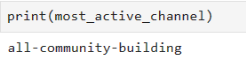

# Welcome to Week-0 Task-1 of 10 Academy's intensive training program!

## Overview

This project focuses on leveraging Git and GitHub for version control, setting up a Python environment, implementing continuous integration and continuous deployment (CI/CD), and employing key performance indicators (KPIs) related to development environment setup and relevant skills. The project also involves utilizing the CRISP-DM framework for project planning and conducting exploratory data analysis (EDA) and statistical thinking.

## Table of Contents

- [Project Title](#Welcome-to-Week-0-Task-1-of-10-Academy's-intensive-training-program!)
  - [Overview](#overview)
  - [Goals to Achieve](#goals-to-achieve)
  - [Installation](#installation)
  - [Usage](#usage)
    - [Branches](#branches)
    - [Commits](#commits)
    - [Code Organization](#code-organization)
    - [Notebooks](#notebooks)
        - [Day 1 Analysis](#day-1-analysis)
    - [Analysis Results](#analysis-results)
        - [Top and Bottom 10 Users](#top-and-bottom-users)
            - [By Reply Count](#Reply-Count)
            - [By Mention Count](#Mention-Count)
            - [By Message Count](#Message-Count)
        - [Top 10 Messages](#top-messages)
            - [By Reply Count](#Replies)
            - [By Mention Count](#Reactions)
            - [By Message Count](#Mentions)
        - [Channel Analysis](#channel-analysis)
        - [Time Analysis](#time-analysis)
  - [Contributing](#contributing)
  - [License](#license)

## Goals to Achieve

- **Dev Environment Setup:** Successfully set up the Python environment, Git version control, and CI/CD.
- **Relevant Skills Demonstration:** Showcase proficiency in the CRISP-DM framework, data understanding, EDA techniques, and statistical thinking.
- **Project Planning - EDA & Stats:** Effectively plan and execute the project using the CRISP-DM framework, perform EDA, and derive actionable insights from statistical analyses.

## Installation

To get started with the project, follow these installation steps:

1. **Python Environment:**
    ```bash
    python -m venv your_env_name
    ```

    Replace `your_env_name` with the desired name for your environment.
    
    **Activate the environment:**

    - On Windows:

    ```bash
    .\your_env_name\scripts\activate
    ```

    - On macOS/Linux:

    ```bash
    source your_env_name/bin/activate
    ```

2. **Clone this package**
    To install the `network_analysis` package, follow these steps:

    1. Clone the repository:
        ```bash
        git clone https://github.com/AbelBekele/10-Academy-Week-0.git
        ```
    2. Navigate to the project directory:
        ```bash
        cd 10-Academy-Week-0
        ```
    
    3. Install the required dependencies:
        ```bash
        pip install -r requirements.txt
        ```


3. **Continuous Integration:**
    - CI/CD configurations are already set up. Refer to the CI/CD documentation for additional details.

## Usage

### Branches

In this repository, the branches are organized as follows:

- **main:** The main branch, initially forked from [https://github.com/10xac/week0_starter_network_analysis](https://github.com/10xac/week0_starter_network_analysis).

- **task-1:** The current branch for Day 1 analysis. 

  ```bash
  git checkout -b task-1
    ```


### Code Organization

Restructured the code by moving functions into `/src/loader.py` and `/src/utils.py`. In the analysis notebooks, used the `SlackDataLoader` from `/src/loader.py` and functions from `/src/utils.py` for data loading needs.

## Notebooks
### Day 1 Analysis
`/notebooks/EDA.ipynb`

## Analysis Results

### Top and Bottom Users

#### Reply Count
- Identify the top and bottom 10 users based on reply count.
  - ***Top and Bottom 10 Users - Reply Count***
   
#### Mention Count
- Identify the top and bottom 10 users based on mention count.
  - ***Top and Bottom 10 Users - Mention Count***
    
#### Message Count
- Identify the top and bottom 10 users based on message count.
  - ***Top and Bottom 10 Users - Message Count***
    

#### Reaction Count
- Identify the top and bottom 10 users based on reaction count.
  - ***Top and Bottom 10 Users - Reaction Count***
    

### Top Messages

#### Replies
- Identify the top 10 messages based on replies.
  - ***Top 10 Messages - Replies***
  

#### Reactions
- Identify the top 10 messages based on reactions.
  - ***Top 10 Messages - Reactions***
  
#### Mentions
- Identify the top 10 messages based on mentions.
  - ***Top 10 Messages - Mentions***
  
### Channel Analysis

- Identify the channel with the highest activity.
- Determine the channel appearing at the right top corner in a 2D scatter plot (x-axis: number of messages, y-axis: sum of replies and reactions, color: channels).
***Channel Analysis***
    - *Scatter plot*
    
    - *channel with the highest activity*
    

### Time Analysis

- Determine the fraction of messages replied within the first 5 minutes.
- Plot a 2D scatter plot (x-axis: time difference between message timestamp and first reply, y-axis: time of the day, color: channels).
***Channel Analysis***
    - *Scatter plot*
    
    - *channel with the highest activity*
    

## Contributing
Contributions are welcome! Before contributing, please review our contribution guidelines.

##  License
This project is licensed under the MIT License.